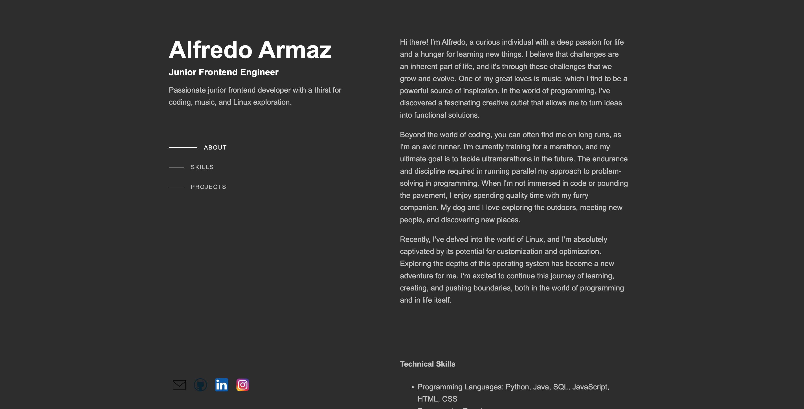
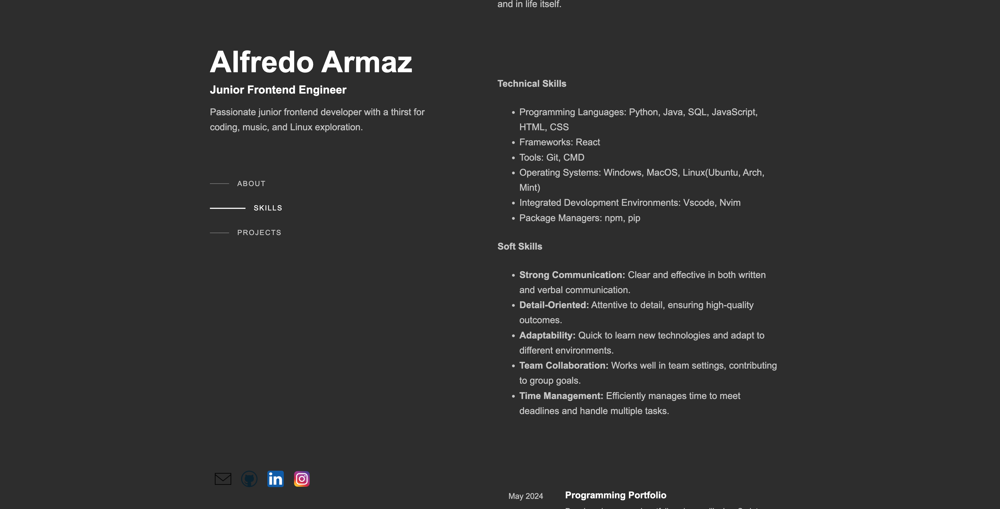
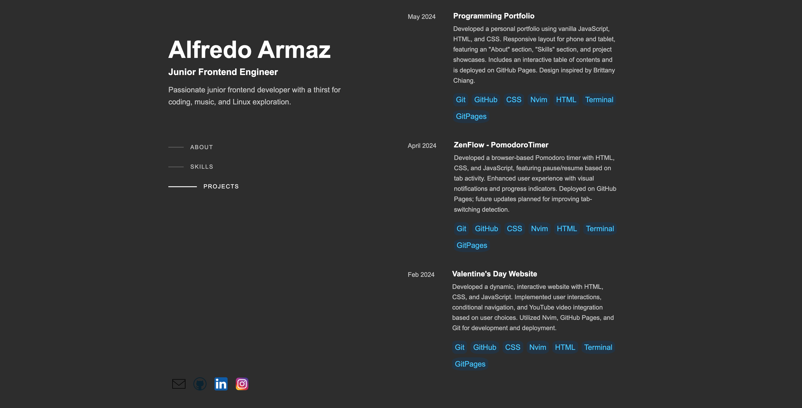
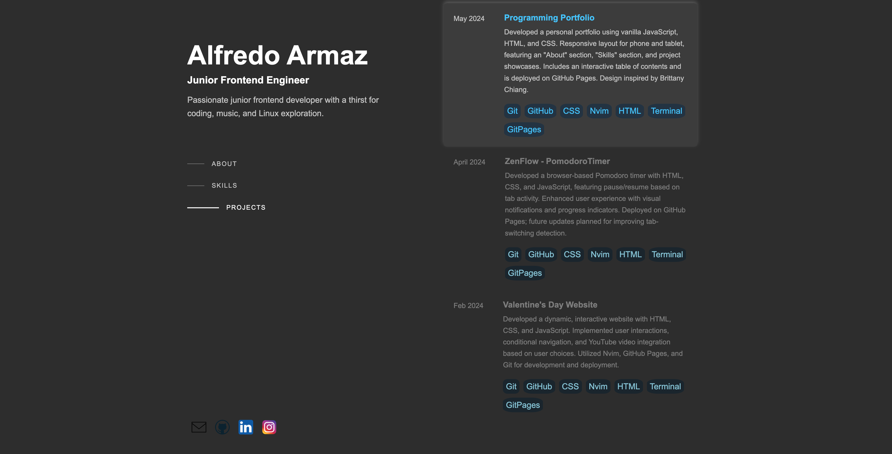
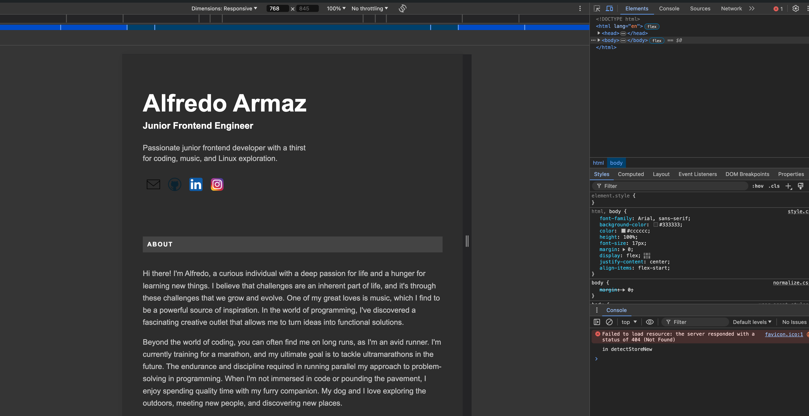
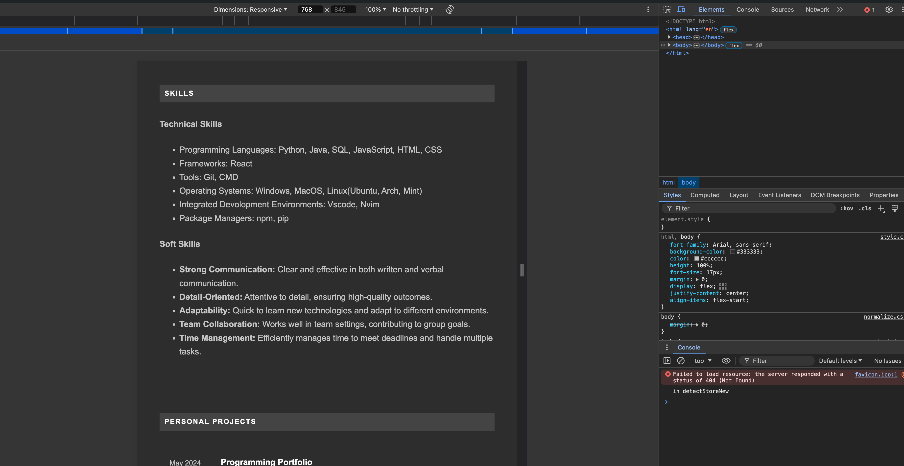
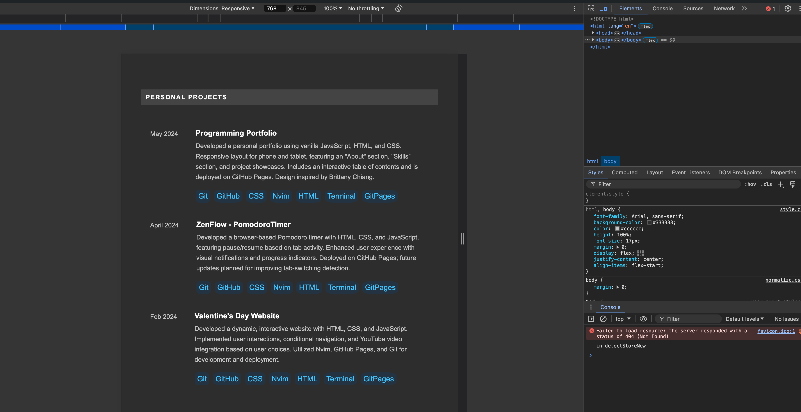
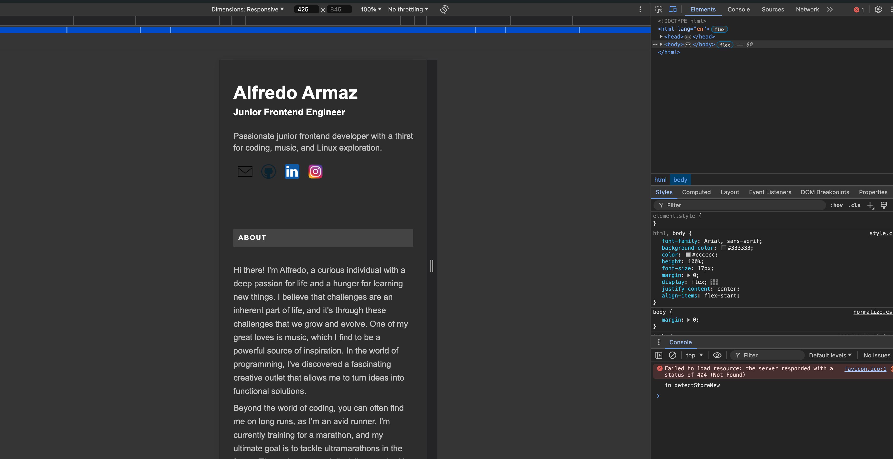
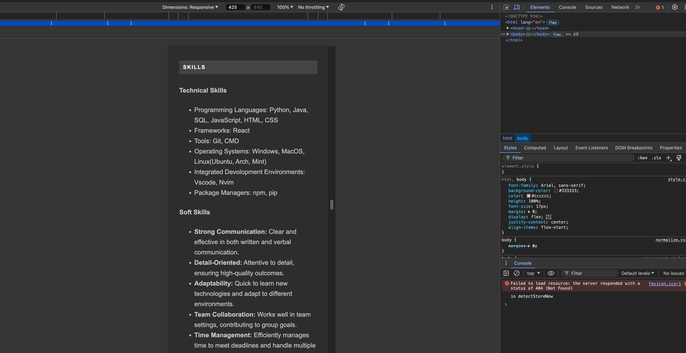
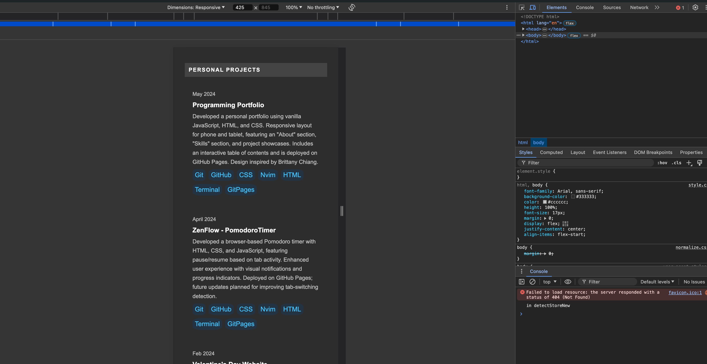

# Programming Portfolio

## 📝Project Description

Developed a personal portfolio using vanilla JavaScript, HTML, and CSS. Responsive
layout for phone and tablet, featuring an "About" section, "Skills" section, and
project showcases. Includes an interactive table of contents and is deployed on
GitHub Pages. Design inspired by Brittany Chiang.

## 💡Key Features

- **Responsive Design**: The layout adapts seamlessly to different screen sizes, including phones and tablets, ensuring a consistent user experience across devices.
- **Interactive Table of Contents**: Navigate through the portfolio easily with a dynamic table of contents that updates to show the current section.
- **About Section**: Provides a brief introduction and personal information, giving visitors insight into your background.
- **Skills Section**: Showcases your technical skills and competencies in various technologies and tools.
- **Project Showcases**: Displays your personal projects with descriptions, screenshots, and links, highlighting your practical experience and achievements.
- **Clean and Modern UI**: Inspired by Brittany Chiang, the design offers a visually appealing and professional look.
- **GitHub Pages Deployment**: The portfolio is live and accessible online via GitHub Pages, allowing easy sharing and visibility.

## ⚙️ Technologies Used

- HTML
- CSS
- JavaScript
- GitHub Pages
- Git via terminal
- nvim editor

## 📹Demo

## 📷 Screenshots

This is how the website will look on a computers

This is how the website will look like on tablets

This is how the website will look like on a phone screen

